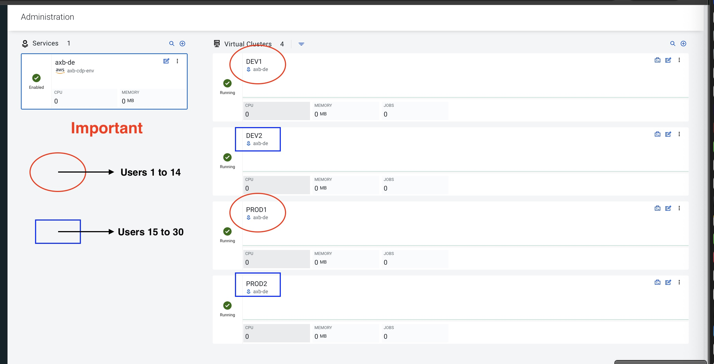
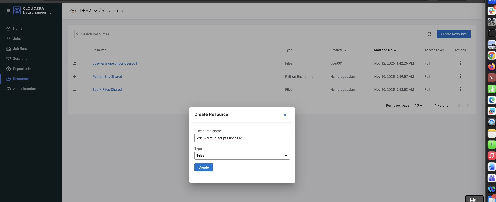
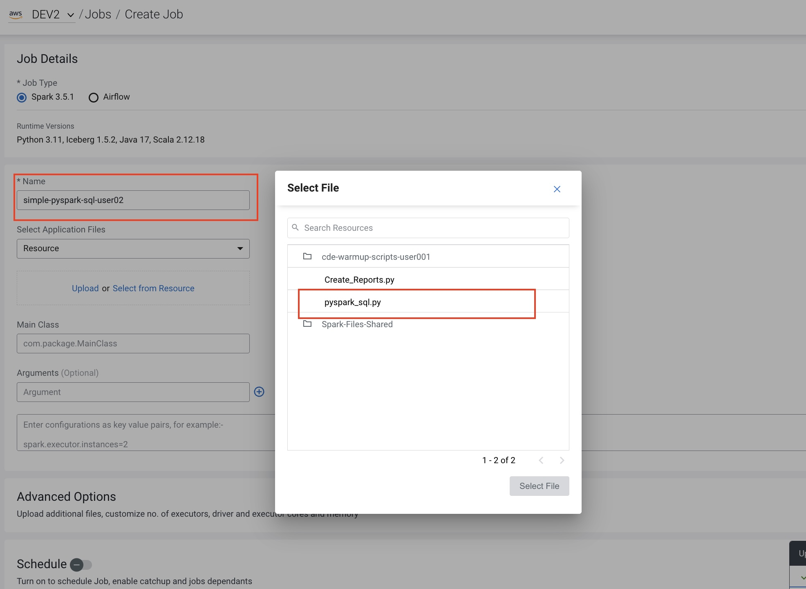
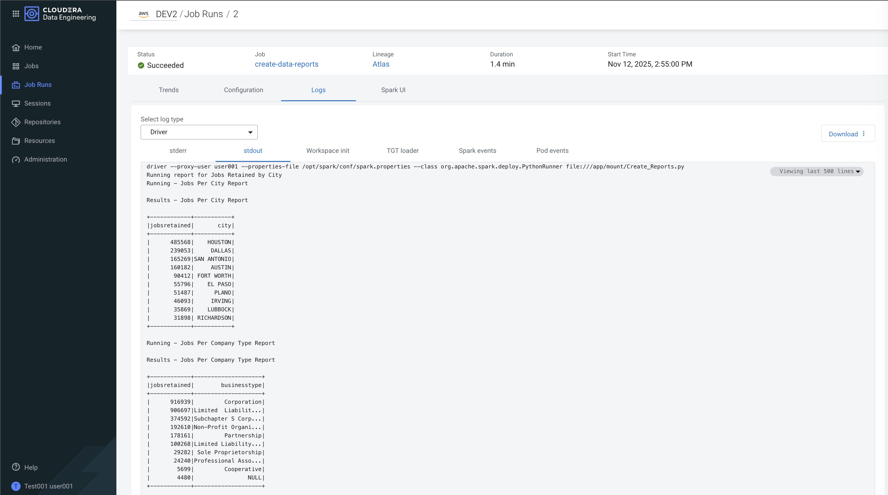

# Lab: CDE Warmup - Running PySpark Jobs from the UI

## 🎯 Objectives

Welcome to the Cloudera Data Engineering (CDE) Warmup Lab. The goal of this exercise is to learn the complete "UI-first" workflow for running custom PySpark scripts in CDE.

This lab is divided into two parts. In Part A, you will run a simple query. In Part B, you will run a more complex job that generates a report.

By the end of this lab, you will be able to:

* Navigate the CDE interface using your workshop credentials.
* Upload local scripts into a CDE **Resource**.
* **Part A:** Create, run, and monitor a simple PySpark job.
* **Part B:** Create, run, and monitor a second, report-building PySpark job.
* Locate and inspect job logs to verify execution and find output.

---

## Prerequisites

This lab is designed for a specific Cloudera workshop environment. Please use the following details to log in and find your assigned resources.

### 1. Workshop Login Details

* **Workshop Login Page:**
    * [https://login.cdpworkshops.cloudera.com/auth/realms/se-workshop-11/protocol/saml/clients/cdp-sso](https://login.cdpworkshops.cloudera.com/auth/realms/se-workshop-11/protocol/saml/clients/cdp-sso)
* **Your User ID:**
    * Your instructor has assigned you a user ID from the range `user001` to `user030`.
* **Workshop Password:**
    * `PROVIDED BY INSTRUCTOR`

### 2. Find Your CDE Service

1.  After logging into the CDP console, click the **Data Engineering** tile.
2.  You will be taken to the Cloudera Data Engineering homepage. On this page, locate and select the CDE Service named **`axb-de`**.

### 3. Identify Your Virtual Cluster

This lab uses a **Development** Virtual Cluster. Your specific cluster depends on your User ID.

> **Important:** Please use the cluster assigned to you to avoid conflicts.

* **If your User ID is `user001` - `user015`:**
    * You will use the **DEV1** Virtual Cluster.
* **If your User ID is `user016` - `user030`:**
    * You will use the **DEV2** Virtual Cluster.

When you click the `axb-de` service, you will see a list of Virtual Clusters. **Click on your assigned cluster (DEV1 or DEV2)** to begin the lab.

*(Note: The PROD1 and PROD2 clusters are for other exercises. We will only use DEV1 or DEV2 for this warmup.)*

### 4. Lab Files

* You must have the lab files (`pyspark_sql.py` and `Create_Reports.py`) from the `cde-warmup-labs/1_ui_basics` directory. Please download them to your local machine before starting.

---

## Setup: Uploading Your Lab Scripts

**Make sure you are inside your assigned Virtual Cluster (DEV1 or DEV2) before proceeding.**

Before we can run a job, CDE needs access to our Python scripts. We do this by uploading them as a **Resource**.

1.  From the left-hand navigation menu, select **Resources**.
2.  Click the **Create Resource** button in the top right corner.
3.  Fill in the details:
    * **Name:** `cde-warmup-scripts-user001` ( use your user name instead of xx)
    * **Resource Type:** `Files`
4.  In the **Upload Files** section, click **Upload...** and select the `pyspark_sql.py` file from your local machine.
5.  Click **Upload...** again and select the `Create_Reports.py` file from your local machine.
6.  Once both files are listed, click **Create**.

You now have a Resource named `cde-warmup-scripts` that contains your two Python files, making them available to any job in this Virtual Cluster.

---

## 🔬 Part A: Simple PySpark SQL Job

### Task 1.1: Create the Spark Job Definition

First, we will define the simple Spark job.

1.  From the left-hand navigation menu, select **Jobs**.
2.  Click the **Create Job** button.
3.  Fill in the following details:
    * **Job Type:** `Spark`
    * **Name:** `simple-pyspark-sql-userxx` ( user your user e.g. user005)
    * **Application File:**
        * Click the **Select...** button.
        * Choose the **`cde-warmup-scripts`** resource you just created.
        * Select the **`pyspark_sql.py`** file. The path should now be `cde-warmup-scripts/pyspark_sql.py`.
    * **Python Version:** Select `Python 3` (or the version appropriate for your environment).
4.  Leave all other settings as default and click **Create**.

### Task 1.2: Run the Job

1.  On the **Jobs** overview page, find your new job: **`simple-pyspark-sql`**.
2.  To the right of the job name, click the "Run" icon (a "play" triangle: ▶).
3.  Click **Run** in the confirmation dialog.
4.  You will be automatically redirected to the **Job Runs** page.

### Task 1.3: Check Execution Status and Logs

1.  On the **Job Runs** page, watch the status of your job. It will transition from **Starting** -> **Running** -> **Succeeded**.
2.  Once the job has succeeded, click on its **Run ID** to open the details page.
3.  Click the **Logs** tab.
4.  Select the **`stdout`** log from the dropdown. Inspect the log to see the output of your PySpark script.

---

## 🔬 Part B: Create Reports Job

Now, let's run the second, more complex job.

### Task 2.1: Create the "Create Reports" Job

1.  Navigate back to the main **Jobs** page.
2.  Click **Create Job**.
3.  Fill in the details for your report-building job:
    * **Job Type:** `Spark`
    * **Name:** `create-data-reports`
    * **Application File:**
        * Click **Select...**
        * Choose the **`cde-warmup-scripts`** resource.
        * Select the **`Create_Reports.py`** file. The path will be `cde-warmup-scripts/Create_Reports.py`.
    * **Python Version:** Select `Python 3`.
4.  Click **Create**.

### Task 2.2: Run the Job

1.  On the **Jobs** overview page, find your new **`create-data-reports`** job.
2.  Click the **Run** (▶) icon and confirm by clicking **Run** again.

### Task 2.3: Check Execution Status and Logs

1.  Monitor the job on the **Job Runs** page until its status is **Succeeded**.
2.  Click the **Run ID** for the `create-data-reports` run.
3.  Click the **Logs** tab.
4.  Inspect the **`stdout`** and **`stderr`** logs. Since this job builds a report, the logs may contain messages confirming the report's creation or its save location in the data lake.

---

## 🏁 Summary

Congratulations! You have successfully completed the CDE UI Warmup Lab.

In this lab, you mastered the fundamental "upload, define, run, monitor" lifecycle for custom PySpark applications in CDE. You have demonstrated how to:

1.  **Upload Code:** Package and upload local Python scripts (`pyspark_sql.py`, `Create_Reports.py`) as a CDE **Resource**.
2.  **Define Jobs:** Create two separate Spark job definitions, `simple-pyspark-sql` and `create-data-reports`, linking them to their respective scripts in your resource.
3.  **Run Jobs:** Manually trigger runs for both jobs directly from the CDE UI.
4.  **Monitor & Debug:** Track the real-time execution status of your jobs and inspect their logs to verify success and find their output.

[def]: ../